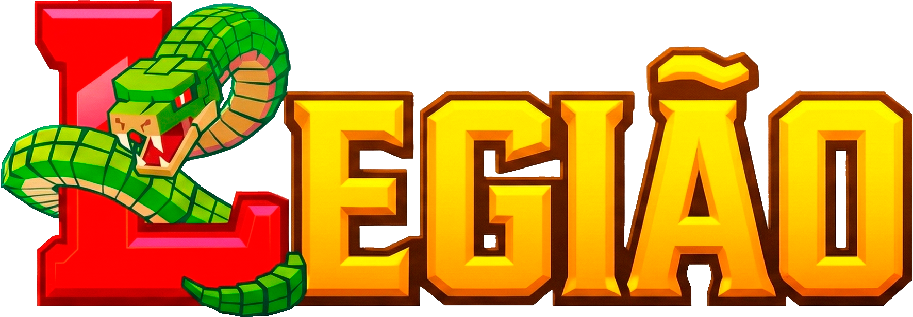

# Bem-vindo à Legião

{ align=center width=300 }

**Legião** não é apenas um modpack. É o equilíbrio perfeito entre a engenharia industrial e a feitiçaria arcana, projetado para oferecer uma experiência de **sobrevivência multiplayer** robusta e otimizada.

Neste mundo, você decide seu caminho: construir fábricas colossais que tocam os céus, virar um grande habilidoso ou simplesmente sobreviver num mundo vanilla+

## 🌟 Destaques do Pacote

* **⚙️ Tecnologia Avançada:** Automatize tudo com *Create*, mas tome nota, nem tudo fica fácil - sacrifícios serão necessários.
* **⚔️ Exploração RPG:** Enfrente bosses lendários do *Cataclysm* e *Mowzie's Mobs*.
* **🚀 Otimização Extrema:** Projetado para rodar suavemente com **Distant Horizons** em PCs intermediários.

!!! info "Status do Projeto"
    Atualmente em **DEV**.

---

# Welcome to Legião

{ align=center width=300 }

**Legião** is not just a modpack. It is the perfect balance between industrial engineering and arcane sorcery, designed to offer a robust and optimized **multiplayer survival** experience.

In this world, you decide your path: build colossal factories that touch the skies, become a highly skilled craftsman, or simply survive in a vanilla+ world.

## 🌟 Pack Highlights

* **⚙️ Advanced Tech:** Automate everything with *Create*, But take note, not everything will be easy - sacrifices will be necessary.
* **⚔️ RPG Exploration:** Face legendary bosses from *Cataclysm* and *Mowzie's Mobs*.
* **🚀 Extreme Optimization:** Designed to run smoothly with **Distant Horizons** on mid-tier PCs.

!!! info "Project Status"
    Currently on **DEV**.

